```mermaid
graph TB
    subgraph Internet["🌐 Internet"]
        GitHub["GitHub<br/>Actions/Webhooks"]
        Teams["MS Teams Bot<br/>Users"]
        External["External Systems<br/>Jira, Bitbucket, etc"]
    end

    subgraph AWS_Region["AWS Region: us-east-1"]
        subgraph IGW_Zone["Internet Gateway Zone"]
            IGW["Internet Gateway<br/>(IGW)"]
        end

        subgraph VPC["VPC: 10.90.64.128/25"]
            subgraph PublicSubnet["Public Subnet (us-east-1a)<br/>10.90.64.128/27"]
                NAT["NAT Gateway<br/>(provides outbound internet)"]
            end

            subgraph PrivateSubnet1["Private Subnet 1 (us-east-1a)<br/>10.90.64.160/27"]
                ALB["Application Load Balancer<br/>(ALB)<br/>Port: 3978"]
                Lambda1["Lambda 1<br/>s3-to-ecs-trigger<br/>handler.py"]
            end

            subgraph PrivateSubnet2["Private Subnet 2 (us-east-1b)<br/>10.90.64.192/27"]
                ECS["ECS Fargate Cluster<br/>selfheal-cluster"]
                ECSService["ECS Service<br/>selfheal-service<br/>Task: Mode=SERVICE<br/>CPU: 256, Mem: 512MB"]
                Lambda2["Lambda 2<br/>post-pr-actions-trigger<br/>handler_post_pr_actions.py"]
                Lambda3["Lambda 3<br/>selfheal_retry<br/>handler_selfheal_retry.py"]
                RDS["RDS Database<br/>SQL Server<br/>AI_PredictiveRecoveryDB<br/>Port: 1433"]
            end

            subgraph VPNZone["Client VPN"]
                VPNE["Client VPN Endpoint<br/>Port: 443 UDP<br/>Cert-based Auth"]
                VPNSG["VPN Security Group"]
            end

            subgraph SecurityZone["Security Groups"]
                ALBSG["ALB-SG<br/>Ingress: VPC CIDR"]
                ECSSG["ECS-SG<br/>Ingress: ALB-SG"]
                RDSSG["RDS-SG<br/>Ingress: ECS-SG"]
            end

            subgraph APIGateway["API Gateway"]
                APIGW["API Gateway<br/>VPC Link to ALB<br/>Teams Bot Endpoint"]
            end
        end

        subgraph AWS_Services["AWS Services"]
            S3["S3 Bucket<br/>self-healing-system-dgs<br/>Multi-tenant Structure:<br/>tenants/tenant_a/<br/>  ├── config/<br/>  ├── incoming/<br/>  └── archive/"]
            
            ECR["ECR Repository<br/>selfheal<br/>Docker Images"]
            
            CloudWatch["CloudWatch Logs<br/>/ecs/selfheal<br/>/aws/lambda/*"]
            
            SecretsManager["AWS Secrets Manager<br/>arn:aws:secretsmanager:<br/>region:*:secret:selfheal/*"]
            
            IAMZone["IAM Roles & Policies"]
        end

        subgraph Certs["VPN Certificates<br/>certs/"]
            ServerCert["server.crt<br/>server.key"]
            CACert["ca.crt<br/>ca.key"]
        end
    end

    subgraph GitHub_Integration["GitHub Actions CI/CD"]
        OIDC["OIDC Provider<br/>token.actions.githubusercontent.com"]
        GithubRole["GitHub Actions IAM Role<br/>ECR Push + Lambda Invoke"]
    end

    %% Internet to AWS connections
    GitHub -->|Webhook| Lambda2
    GitHub -->|OIDC| OIDC
    Teams -->|Invoke Endpoint| APIGW
    External -->|Webhook| APIGW

    %% IGW connections
    IGW <-->|NAT| NAT
    NAT -->|Outbound Traffic| Internet

    %% VPC Internal flows
    APIGW -->|VPC Link| ALB
    ALB -->|Target Group| ECSService
    
    %% S3 to Lambda flow
    S3 -->|ObjectCreated Event| Lambda1
    Lambda1 -->|Run Task| ECSService
    
    %% GitHub to Lambda flows
    Lambda2 -->|Run Task<br/>MODE=PR_EVENT| ECSService
    Lambda3 -->|Run Task<br/>MODE=RETRY| ECSService
    
    %% ECS to Database
    ECSService -->|SQL Queries<br/>Port 1433| RDS
    
    %% Container to external services
    ECSService -->|Pull Secrets| SecretsManager
    ECSService -->|CloudWatch Logs| CloudWatch
    
    %% ECR Integration
    ECSService -->|Pull Image| ECR
    GitHub -->|Push Image<br/>via Actions| ECR
    GithubRole -->|Permissions| ECR
    GithubRole -->|Permissions| Lambda2
    GithubRole -->|Permissions| Lambda3
    
    %% VPN
    VPNE -.->|VPC CIDR Access| VPC
    VPNSG -->|Rules| VPNE
    
    %% Security Groups
    ALB --> ALBSG
    ECSService --> ECSSG
    RDS --> RDSSG
    
    %% Certificates
    VPNE -->|Uses| ServerCert
    VPNE -->|Uses| CACert

    %% IAM
    Lambda1 -.->|AssumeRole| IAMZone
    Lambda2 -.->|AssumeRole| IAMZone
    Lambda3 -.->|AssumeRole| IAMZone
    ECSService -.->|AssumeRole| IAMZone
    
    %% Styling
    classDef internet fill:#FF9999,stroke:#CC0000,stroke-width:2px,color:#000
    classDef vpc fill:#B3D9FF,stroke:#0066CC,stroke-width:2px,color:#000
    classDef compute fill:#90EE90,stroke:#009900,stroke-width:2px,color:#000
    classDef storage fill:#FFD700,stroke:#FF9900,stroke-width:2px,color:#000
    classDef security fill:#DDA0DD,stroke:#8B008B,stroke-width:2px,color:#000
    classDef network fill:#87CEEB,stroke:#4169E1,stroke-width:2px,color:#000
    classDef database fill:#FF6B6B,stroke:#CC0000,stroke-width:2px,color:#fff
    
    class Internet internet
    class GitHub,Teams,External internet
    class VPC,PublicSubnet,PrivateSubnet1,PrivateSubnet2,VPNZone,APIGateway vpc
    class ECS,ECSService,Lambda1,Lambda2,Lambda3,ALB compute
    class S3,ECR,CloudWatch,SecretsManager storage
    class VPNE,VPNSG,SecurityZone,ALBSG,ECSSG,RDSSG,Certs security
    class IGW,NAT,APIGW network
    class RDS database
    class GitHub_Integration,OIDC,GithubRole security
```

## Architecture Flow Explanation

### **1. Data Ingestion Paths**

#### Path A: S3 Trigger → ECS Processing
```
Error Log Uploaded to S3
    ↓
S3 Event Notification (ObjectCreated)
    ↓
Lambda 1: s3-to-ecs-trigger
    ├─ Validates S3 object
    ├─ Extracts tenant_id from key
    └─ Launches ECS Task (MODE=JOB)
    ↓
ECS Task Processes Error Log
    ├─ Reads from S3
    ├─ Analyzes error
    ├─ Stores results in RDS
    └─ Archives to S3
```

#### Path B: GitHub PR Webhook → ECS Processing
```
GitHub Actions Workflow Completes (or PR created)
    ↓
Webhook to Lambda 2: post-pr-actions-trigger
    ├─ Parses GitHub event payload
    ├─ Extracts tenant_id and PR details
    └─ Launches ECS Task (MODE=PR_EVENT)
    ↓
ECS Task Handles PR Actions
    ├─ Performs code review
    ├─ Runs tests
    ├─ Updates PR status
    └─ Triggers deployments if needed
```

#### Path C: Manual Retry → ECS Processing
```
Failure Detected (via CloudWatch, manual trigger, etc)
    ↓
Lambda 3: selfheal_retry
    ├─ Receives retry payload
    ├─ Validates tenant_id
    └─ Launches ECS Task (MODE=RETRY)
    ↓
ECS Task Retries Operation
    ├─ Re-processes failed operation
    ├─ Uses exponential backoff
    ├─ Logs retry attempts
    └─ Notifies on success/failure
```

---

### **2. Network Security Layers**

#### Layer 1: Internet Gateway & NAT
- **Internet Gateway (IGW):** Routes internet traffic to/from public subnet
- **NAT Gateway:** Provides secure outbound access for private subnets
- **Key Point:** No direct inbound from internet to private resources

#### Layer 2: Security Groups (Firewall Rules)
```
Internet (Teams Users, GitHub)
    ↓
API Gateway (public endpoint)
    ↓
ALB Security Group (allows VPC CIDR)
    ↓
Application Load Balancer
    ↓
ECS Security Group (allows ALB-SG)
    ↓
ECS Fargate Tasks
    ↓
RDS Security Group (allows ECS-SG only)
    ↓
RDS Database
```

#### Layer 3: VPC Isolation
- All resources in private subnets
- No direct internet access to ECS/RDS
- Only through NAT Gateway for outbound

---

### **3. Data Storage & Retrieval**

#### S3 Multi-Tenant Structure
```
S3 Bucket: self-healing-system-dgs
├── tenants/
│   ├── tenant_a/
│   │   ├── config/
│   │   │   └── configuration.json
│   │   ├── incoming/
│   │   │   ├── error_2024_08_10_001.log
│   │   │   └── error_2024_08_10_002.log
│   │   └── archive/
│   │       └── error_2024_08_09_*.log (processed)
│   ├── tenant_b/
│   │   ├── config/
│   │   ├── incoming/
│   │   └── archive/
```

#### RDS Database
- **Engine:** SQL Server
- **Database:** AI_PredictiveRecoveryDB
- **Tables:** ErrorLogs, RecoveryActions, AuditTrail, etc.
- **Access:** Only from ECS tasks via private network

---

### **4. Container Execution Modes**

The ECS task definition supports multiple modes via environment variables:

| Mode | Trigger | Purpose | Example |
|------|---------|---------|---------|
| `SERVICE` | Continuous | Main service, listens to API | ALB receives Teams requests |
| `JOB` | S3 event | Process single error log | Error file uploaded → processed |
| `PR_EVENT` | GitHub webhook | Handle PR-related actions | PR merged → trigger deployment |
| `RETRY` | Lambda invoke | Retry failed operation | Previous failure → retry logic |

---

### **5. CI/CD Pipeline with GitHub Actions**

```
GitHub Actions Workflow
    ↓
Uses OIDC for AWS Authentication (no hardcoded keys!)
    ├─ Builds Docker image
    ├─ Pushes to ECR via GitHub Actions IAM Role
    └─ (Optional) Invokes Lambda to trigger ECS tasks
    ↓
ECR: selfheal repository updated
    ↓
ECS Service (can auto-deploy on image update)
```

---

### **6. Monitoring & Logging**

```
CloudWatch Logs
├── /ecs/selfheal
│   └── Task logs (stdout/stderr)
├── /aws/lambda/s3-to-ecs-trigger
│   └── Lambda execution logs
├── /aws/lambda/post-pr-actions-trigger
│   └── GitHub event logs
└── /aws/lambda/selfheal_retry
    └── Retry attempt logs

X-Ray (Optional)
└── Distributed tracing of request flows
```

---

### **7. Secrets & Credentials Management**

```
AWS Secrets Manager
└── arn:aws:secretsmanager:us-east-1:*:secret:selfheal/*
    ├── DATABASE_URL
    ├── API_KEYS
    ├── JIRA_TOKEN
    ├── GITHUB_TOKEN
    ├── BEDROCK_CREDENTIALS
    └── Other sensitive data

IAM Policies
├── ECS Execution Role
│   └── Can read secrets: secretsmanager:GetSecretValue
├── ECS Task Role
│   ├── Can read secrets
│   ├── Can access S3
│   └── Can write to CloudWatch
├── Lambda Roles
│   ├── Can invoke ECS tasks
│   └── Can access appropriate resources
└── GitHub Actions Role (OIDC)
    ├── Can push to ECR
    └── Can invoke Lambda functions

KMS Keys
└── Encryption for secrets at rest
```

---

### **8. High Availability & Disaster Recovery**

```
Current Setup:
├── ECS: Single task (can scale to multiple)
├── RDS: Multi-AZ (primary in us-east-1a, replica in us-east-1b)
├── NAT Gateway: Single (can add more for HA)
└── Subnets: Spread across 2 AZs

Scaling Strategy:
├── ECS: Increase desired_count from 1 to N
├── RDS: Already Multi-AZ by default
├── Lambda: Automatically scales (serverless)
└── S3: Unlimited scalability
```

---

### **9. Request Flow Example: Teams Bot Message**

```
User sends message in Teams
    ↓
Teams Bot webhook
    ↓
API Gateway endpoint (Teams callback URL)
    ↓
API Gateway → ALB via VPC Link
    ↓
ALB routes to ECS Service (Target Group)
    ↓
ECS Task (MODE=SERVICE)
    ├─ Receives request
    ├─ Processes message
    ├─ Queries RDS for context
    └─ Formulates response
    ↓
Response sent back through ALB
    ↓
API Gateway
    ↓
Teams Bot
    ↓
User receives response in Teams
```

---

### **10. Cost Optimization Notes**

- **NAT Gateway:** Single NAT for all private subnets (cheaper than per-subnet)
- **ECS:** Fargate Spot (can use for non-critical workloads)
- **RDS:** t3.micro initially, scale up as needed
- **Lambda:** Pay per invocation, no server costs
- **S3:** Only pay for storage + API calls

---

## Key Architectural Principles

### 1. **Layered Security**
- Multiple layers: IGW → NAT → Security Groups → Network ACLs
- Data encryption in transit and at rest
- No direct internet access to sensitive resources

### 2. **Scalability**
- Serverless components (Lambda, S3)
- Auto-scaling capable (ECS, RDS)
- Multi-AZ deployment for high availability

### 3. **Flexibility**
- Multiple trigger points (S3, GitHub, API, manual)
- Different execution modes for different purposes
- Multi-tenant support via S3 structure

### 4. **Monitoring & Debugging**
- CloudWatch logs for all components
- X-Ray for distributed tracing
- Detailed error tracking in RDS

### 5. **Infrastructure as Code**
- Terraform for reproducible deployments
- Version-controlled configuration
- Modular design for reusability

