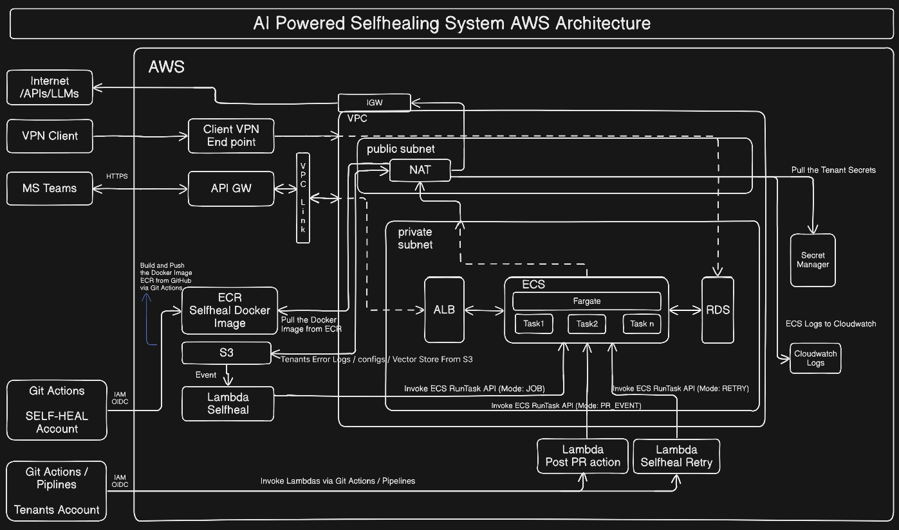

# Selfheal Deployment Setup

This document provides step-by-step instructions for setting up the **Selfheal** system on AWS with Docker and ECR.
---

## Architecture



---

## Prerequisites

- AWS account with VPC configured  
- AWS CLI installed and configured  
- Docker installed  
- Git installed  
- AWS VPN Client installed

---

## Terraform setup

1. Update the terraform.tfvars
	region                                = "us-east-1"

	image_url                             = "<ACCOUNT>.dkr.ecr.us-east-1.amazonaws.com/selfheal:latest"


	db_username                           = username of choice (admin username)
	db_password                           = password of choice (admin password)


	server_cert_path                      = "./certs/server.crt" (You can generate using VPN certs step )
	server_key_path                       = "./certs/server.key"
	ca_cert_path                          = "./certs/ca.crt"
	ca_key_path                           = "./certs/ca.key"

	bucket_name                           = "self-healing-system-dgs" 
	

2. Add the secrets in secretsManager module in main.tfvars
3. VPN certs (Steps to generate if new certs required)
	#!/bin/bash
	mkdir -p certs
	cd certs
	openssl genrsa -out ca.key 2048
	openssl req -new -x509 -days 3650 -key ca.key -out ca.crt -subj "/CN=SelfhealVPN-CA"
	openssl genrsa -out server.key 2048
	openssl req -new -key server.key -out server.csr -subj "/CN=selfheal-vpn-server"
	openssl x509 -req -in server.csr -CA ca.crt -CAkey ca.key -CAcreateserial -out server.crt -days 365
	rm server.csr

	Download .ovpn
    - Go to AWS Console
	- EC2 → Client VPN Endpoints
	- Select respective vpn
	- Click "Download client configuration"
	- Save as client-vpn.ovpn
	
4. Next VPN setup :
	Follow the steps in "resources/AWS_VPN_Client_setup.pdf"

- Configure the above in the terraform.tfvars the run 
   ```bash
   terraform init
   ```
   ```bash
   terraform apply
---

## Docker Image Workflow (It is automated through CICD, no manual push needed)

- Clone the repository:
   ```bash
  git clone [git@github.com:Basavaraj011/error_handling_system.git](https://github.com/darshita-singh/error_handling_system.git)
- Or
   ```bash
   git clone git@github.com:darshita-singh/error_handling_system.git
- Build the Docker image:
   ```bash
   docker build -t selfheal .
- Authenticate Docker with AWS ECR:
   ```bash
   aws ecr get-login-password --region ap-south-1 \
   | docker login --username AWS --password-stdin 960451805606.dkr.ecr.ap-south-1.amazonaws.com
- Tag the Docker image:
   ```bash
   docker tag selfheal:latest 960451805606.dkr.ecr.ap-south-1.amazonaws.com/selfheal:latest

- Push the Docker image:
   ```bash
   docker push 960451805606.dkr.ecr.ap-south-1.amazonaws.com/selfheal:latest

## VPN Setup
- Note the VPN endpoint and update the .ovpn file.
- Download and install the AWS VPN Client if not already installed.

## Database Setup
- Note the DB endpoint and update environment variables.
- Connect to the DB using:
- Username: username
- Password: password
- Auth: SQL Server Auth
- Server Type: Database Engine
- Server Name: RDS Endpoint
- Create the required tables in the database.

## Teams Bot Configuration
- Replace the callback URL with the API Gateway invoke URL in the Teams bot configuration.

## Summary
This setup ensures:
- Proper networking with public and private subnets.
- Secure routing via IGW and NAT.
- Docker image built, tagged, and pushed to AWS ECR.
- Database connection established and tables created.
- VPN configured for secure access.
- Teams bot integrated with API Gateway.
